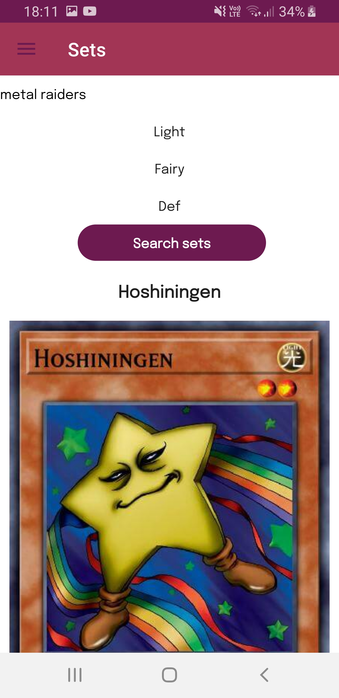
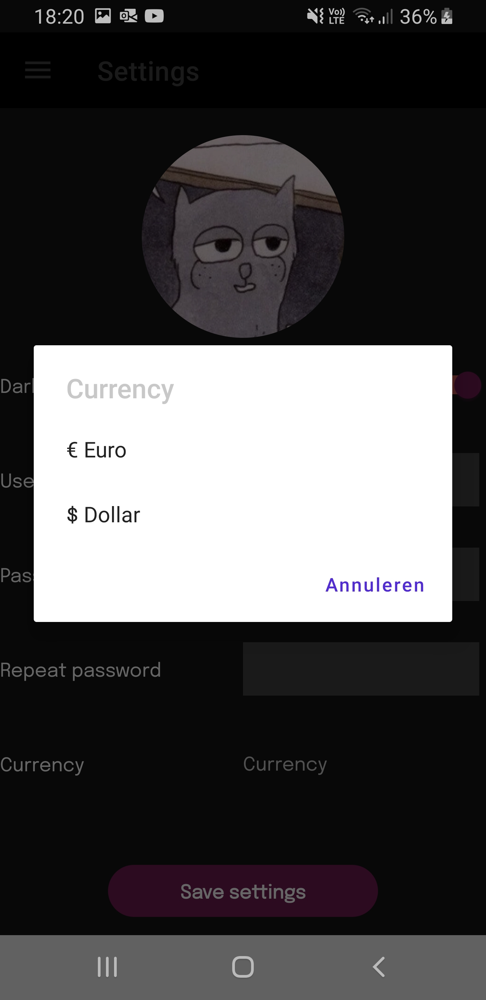

# Project C# Mobile 2022-2023
Naam en email: **Christos Lappas, lappas.christos@outlook.com/11306406@student.pxl.be**

Titel applicatie: **Yu-Gi-Oh! Card Collector**

Deze app is gemaakt voor fans van het kaartenspel Yu-Gi-Oh! dat gebaseerd is op de populaire animereeks. 
Het is de bedoeling om een overzicht te krijgen van kaarten die spelers bezitten om een beter zicht te hebben op wat ze nog nodig hebben om een goede deck samen te stellen. 
Verder kunnen ze ook de prijzen in de gaten houden om te zien wat het hun uiteindelijk gaat kosten om dit deck samen te stellen. 
Ze kunnen ook zien in welke sets de kaarten zitten zodat ze weten welke ze moeten kopen.

Opsomming belangrijkste kenmerken en onderdelen/features van de applicatie: 
* Kaarten bijhouden die je bezit
* Kaarten in een wishlist zetten die je nog zou willen hebben
* Prijzen van kaarten in de gaten houden
* Sets van kaarten kunnen zien en welke kaarten hier van deel uitmaken
* Decks kunnen samenstellen

# Logboek
* 15/11/2022 - 26/11/2022 : Test project gemaakt om te achterhalen hoe ik een API moet consumen
* 27/11/2022 : Aanmaak officieel project, aanmaken views, viewmodels, toevoegen icons
* 28/11/2022 : GET requests om kaarten op te halen
* 29/11/2022 : Login, register en sqlite toegevoegd
* 30/11/2022 : Models toegevoegd
* 01/12/2022 : Decks aanmaken
* 02/12/2022 : Decks updaten
* 05/12/2022 : Event to command behaviors toegevoegd
* 06/12/2022 : Deck cards en wishlist toegevoegd
* 07/12/2022 : Add to wishlist
* 10/12/2022 : Sets, toast notificaties, delete button toegevoegd
* 11/12/2022 : Settings toegevoegd
* 12/12/2022 : Add to deck button, deck delete button
* 13/12/2022 : Dark mode toegevoegd
* 19/12/2022 : Change username
* 26/12/2022 : Attribute, race picker toegevoegd
* 27/12/2022 : Filter toegevoegd
* 28/12/2022 : Styles, splash screen toegevoegd
* 29/12/2022 : Converter toegevoegd
* 30/12/2022 : Styling, gradient, theme toegevoegd
* 31/12/2022 : Valuta toegevoegd
* 02/01/2023 : Settings aangepast, sorteren toegevoegd, nieuwe font toegevoegd
* 08/01/2023 : Error handling
* 09/01/2023 : Error handling
* 11/01/2023 : Lottie animations toegevoegd
* 14/01/2023 : Profilepicture uploaden met FilePicker

# Optioneel: Screenshots

# Videolink

https://www.youtube.com/watch?v=MzPJaIu3GW8

# Bronnen
* https://www.youtube.com/watch?v=XFP8Np-uRWc
  Hoe je sqlite gebruikt bij MAUI
* https://learn.microsoft.com/en-us/dotnet/maui/fundamentals/data-binding/converters?view=net-maui-7.0
  Hoe je converters moet gebruiken
* https://learn.microsoft.com/en-us/dotnet/maui/user-interface/styles/xaml?view=net-maui-7.0
  Hoe je styles moet gebruiken
* https://learn.microsoft.com/en-us/dotnet/maui/user-interface/controls/picker?view=net-maui-7.0
  Hoe je een picker gebruikt
* https://learn.microsoft.com/en-us/dotnet/maui/user-interface/brushes/lineargradient?view=net-maui-7.0
  Hoe je een gradient toepast
* https://learn.microsoft.com/en-us/dotnet/maui/user-interface/controls/frame?view=net-maui-7.0
  Hoe je een frame gebruikt
* https://learn.microsoft.com/en-us/dotnet/communitytoolkit/maui/alerts/toast?tabs=android
  Hoe je toast toepast 
* https://www.youtube.com/watch?v=o5X5yXdWpuc&t=471s
  Hoe je lottie animations implementeert
* https://www.youtube.com/watch?v=Wg1fhr3iwKY
  Hoe je FilePicker gebruikt om afbeeldingen te uploaden

# Future work
Ik zou spelers het tegen elkaar laten opnemen in duels. Ik zou dat met SignalR doen.

---
## *Opmerking**
# Extra's
* Custom splash screen
* Upload image met FilePicker
* Lottie animations

